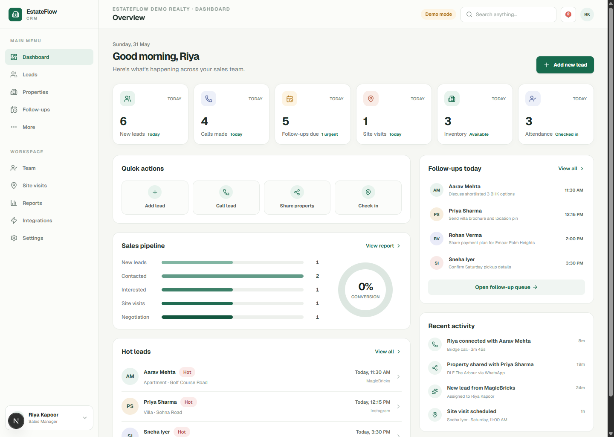
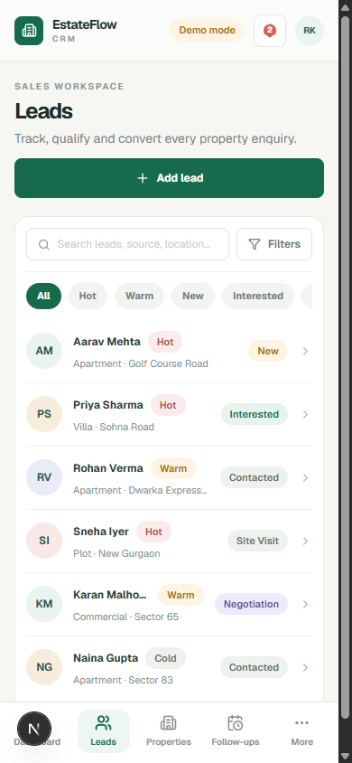
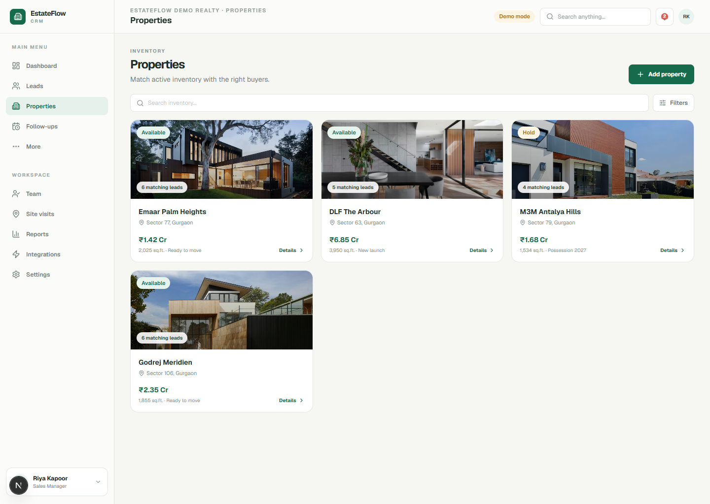

# EstateFlow CRM

## Turn Every Property Enquiry Into A Sales Opportunity

EstateFlow CRM is a mobile-first workspace for real estate teams. It helps your team respond to new enquiries faster, organize every buyer conversation, match prospects with the right listings, and keep sales activity visible from one dashboard.

Leads, calls, listings, follow-ups, site visits, attendance, and team performance stay connected in one place.

## The Problem EstateFlow Solves

Property enquiries arrive from portals, advertisements, websites, social media, and referrals. When those leads are scattered across spreadsheets, inboxes, and messaging apps, follow-ups are delayed and opportunities get missed.

EstateFlow gives your team a repeatable sales process:

- Capture every enquiry in one queue.
- Route new leads to available sales agents.
- Call prospects while their interest is still fresh.
- Recommend matching properties from active inventory.
- Share photos, brochures, and listing details in a few taps.
- Keep follow-ups, visits, and outcomes visible to managers.

## From New Enquiry To Site Visit

## Respond Faster To New Leads

New enquiries from website forms, campaigns, or connected lead sources enter the sales queue automatically. EstateFlow assigns an available agent and can start an agent-first call flow: the sales agent answers first, then EstateFlow connects the buyer.

If an agent is unavailable, the lead remains visible for follow-up so the team can act before the opportunity goes cold.

## Keep Every Buyer Conversation Organized

Your team can search, qualify, and update leads from a clean mobile workspace. Each buyer record keeps the important context together:

- Contact details and lead source
- Preferred location, property type, and budget
- Assigned sales agent
- Lead temperature and sales stage
- Notes, calls, messages, follow-ups, and property shares

## Match Buyers With The Right Inventory

EstateFlow keeps property listings organized with photos, brochures, price, location, availability, and property details. Sales teams can quickly identify listings that match an active buyer and share a public property page through WhatsApp, SMS, or email.

## One Workspace For The Whole Team

### Sales Dashboard

See new leads, calls, follow-ups, site visits, active inventory, attendance, pipeline movement, hot leads, and recent activity at a glance.

### Follow-Up Queue

Send quick follow-ups, schedule reminders, snooze tasks, mark conversations complete, and receive due notifications.

### Site Visits

Assign property walkthroughs to field executives, record notes, and track completed visits.

### Team Attendance

Let field teams check in and out with browser GPS, maintain attendance history, and keep daily team availability visible.

### Social Media Calendar

Plan property content, create post drafts, schedule publishing tasks, attach media, and manage campaign activity.

### Reports

Review lead sources, sales stages, agent call activity, follow-up completion, property shares, conversion, inventory, and attendance.

## Built For Every Real Estate Role

| Role | What EstateFlow Helps Them Do |
| --- | --- |
| Business owner | Monitor leads, inventory, team activity, and sales performance |
| Sales manager | Assign enquiries, track agent progress, and manage follow-ups |
| Sales agent | Call prospects, update leads, share properties, and schedule next steps |
| Field executive | Track attendance and complete assigned site visits |
| Social media manager | Plan, schedule, and manage listing content |

## Property Portal Support

EstateFlow can receive buyer enquiries from connected portals, campaigns, website forms, and automation tools.

Property inventory can be added with photos and documents, then matched and shared from the CRM. Automatic listing synchronization with portals such as MagicBricks, 99acres, or Housing.com can be connected when an authorized API, partner feed, or export file is available.

## Designed For The Way Real Estate Teams Work

- Mobile-first interface for teams working from the field
- Large tap targets and quick actions
- Organization-based workspaces
- Role-based access for sales, field, and content teams
- In-app notifications for important activity
- Public property share pages for buyers
- Installable mobile web app experience

## EstateFlow CRM

Capture leads faster. Call buyers sooner. Share the right properties. Keep every follow-up visible.
