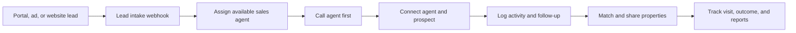

# EstateFlow CRM

EstateFlow CRM is a mobile-first sales workspace for real estate teams. It brings incoming property enquiries, agent follow-ups, listing inventory, site visits, attendance, and sales reporting into one organization-scoped system.

The application is built with Next.js, TypeScript, Tailwind CSS, Supabase, and provider adapters for Twilio and email delivery. It runs immediately in browser-based demo mode and can be connected to Supabase for authenticated multi-tenant operation.

## The Problem

Real estate teams receive leads from multiple sources such as MagicBricks, 99acres, Housing.com, social campaigns, website forms, and referrals. Those enquiries often land in separate inboxes or spreadsheets. By the time someone assigns the lead, calls the prospect, finds a suitable property, and schedules a follow-up, the prospect may already be speaking with another broker.

EstateFlow CRM is designed to shorten that response loop:

- Collect enquiries in one lead queue.
- Assign webhook leads to available sales agents.
- Start an agent-first bridge call so the team can contact new prospects quickly.
- Match buyers with active inventory.
- Share property details and photos through a public link.
- Keep follow-ups, field visits, attendance, and sales reporting visible to the team.

## Product Preview

### Sales Dashboard


### Property Inventory


### Mobile Lead Workspace


## Core Workflow



## What It Includes

| Area | Capabilities |
| --- | --- |
| Dashboard | Lead, call, follow-up, site-visit, inventory, attendance, pipeline, and recent-activity summaries |
| Leads | Manual creation, webhook intake, search, filters, assignment, qualification, notes, timeline, hot-lead marking, calls, follow-ups, and property sharing |
| Voice automation | Twilio agent-first bridge calls, conference flow, recording callback support, retry handling, call logs, and local dry-run mode |
| Inventory | Property creation, search, filters, galleries, brochures, status updates, matching-lead counts, recommended properties, and protected deletion |
| Property sharing | Public tokenized listing pages plus WhatsApp, SMS, and email dispatch adapters |
| Follow-ups | Templates, one-click messages, call reminders, scheduling, completion, snoozing, and due notifications |
| Field operations | GPS attendance, private selfie evidence, attendance history, site-visit assignment, notes, and completion |
| Social media | Draft calendar, scheduled posts, media uploads, AI-caption placeholder, and optional publishing webhook |
| Team management | Supabase invitations, role updates, agent availability, and organization-scoped access |
| Reports | Lead sources, pipeline status, agent call activity, follow-up completion, property shares, conversion, inventory, and attendance |

## Property Portal Imports

EstateFlow currently imports **leads** through `POST /api/webhooks/leads`. Property listings can be created manually, uploaded with photos and documents, and shared from the CRM.

Automatic listing synchronization from portals such as MagicBricks, 99acres, or Housing.com requires an authorized partner API, feed, or export file from the portal. Direct website scraping is intentionally not included because it is brittle and may violate portal terms. A production extension can add CSV import and authorized portal-sync adapters without changing the inventory model.

## Roles And Data Isolation

Every live workspace belongs to an organization. Supabase Row Level Security policies keep organization data isolated and limit operations by role:

- **Admin / Business Owner**: manage the organization, team, inventory, integrations, and reports.
- **Sales Manager**: manage leads, assignments, inventory, visits, and performance.
- **Sales Agent**: work assigned leads, calls, shares, notes, and follow-ups.
- **Field Executive**: record attendance and complete assigned site visits.
- **Social Media Manager**: manage the content calendar and publishing workflow.

Provider credentials stay server-side. The browser receives provisioning status, not secret values.

## Quick Start

Requirements:

- Node.js 20+
- npm

```bash
npm install
copy .env.example .env.local
npm run dev
```

Open [http://localhost:3000](http://localhost:3000).

When public Supabase values are blank, the application opens in local demo mode and stores interactive changes under `estateflow.*` browser-storage keys. Use **More > Settings > Reset demo data** to restore the seeded workspace without removing unrelated browser data.

## Available Commands

```bash
npm run dev     # Start local development
npm run lint    # Run ESLint
npm run build   # Create the production build
npm run start   # Serve the production build
```

## Supabase Setup

Create a Supabase project, copy the values described in `.env.example`, and apply the SQL migrations from `supabase/migrations/`.

For local Supabase development:

```bash
supabase db reset
```

The reset applies the migrations and `supabase/seed.sql`. Seeded local users use the password `estateflow123`; for example, sign in as `admin@estateflow.local`. Replace seeded credentials outside local development.

## Lead Intake Webhook

External lead providers, Zapier, Make, or website forms can submit enquiries to:

```text
POST /api/webhooks/leads
```

Example:

```bash
curl -X POST http://localhost:3000/api/webhooks/leads \
  -H "Content-Type: application/json" \
  -H "x-webhook-secret: $LEAD_WEBHOOK_SECRET" \
  -d '{"fullName":"Rahul Sharma","phone":"+919999999999","source":"MagicBricks","propertyType":"Apartment","preferredLocation":"Gurgaon"}'
```

With Supabase configured, the route validates the optional webhook secret, stores the lead, assigns an available agent through the database round-robin function, starts the bridge-call adapter, and records the call, activity, and notification. Without Supabase values, it returns a dry-run response for local development.

## Twilio Voice Bridge

Keep `TWILIO_DRY_RUN=true` while developing locally. To enable live calls:

1. Set `TWILIO_ACCOUNT_SID`, `TWILIO_AUTH_TOKEN`, and `TWILIO_PHONE_NUMBER`.
2. Set `NEXT_PUBLIC_APP_URL` to a public HTTPS deployment or tunnel URL that Twilio can reach.
3. Set `TWILIO_DRY_RUN=false`.
4. Keep `TWILIO_VALIDATE_SIGNATURES=true`.
5. Set `TWILIO_MAX_AGENT_ATTEMPTS` to control retry behavior.

Twilio calls the generated `/api/twilio/voice/*` routes to gather agent confirmation, dial the lead, bridge both parties into a recorded conference, and persist status, duration, and recording URL. If an agent is unavailable, the service retries another available agent before creating a missed-call follow-up.

## Notifications

The in-app notification center records lead assignments, missed calls, scheduled follow-ups, site visits, property shares, attendance issues, and social-post reminders.

`vercel.json` invokes `GET /api/cron/notifications` daily at `05:00 UTC`. Set a random `CRON_SECRET` with at least 16 characters in Vercel so scheduled invocations include the expected bearer token.

## Deployment

Deploy the repository as a standard Next.js project on Vercel:

1. Create a Supabase project and apply the migrations.
2. Add the `.env.example` values to Vercel environment variables.
3. Keep provider secrets server-side.
4. Deploy the application.
5. Verify authentication, the lead webhook, the cron route, and public property-share links.

The application includes a PWA manifest and cached shell. After deployment to HTTPS, Android users can install it through Chrome using **Install app** or **Add to Home screen**.

## Project Structure

```text
src/app/                  Next.js pages and API routes
src/components/           CRM shell, forms, and workspace tools
src/lib/                  Types, demo data, Supabase clients, and helpers
src/services/             Provider-independent business adapters
supabase/migrations/      Tenant-aware schema and RLS policies
supabase/seed.sql         Local development fixtures
public/readme/            Product screenshots used in this README
```

## Architecture Notes

- Server inputs are validated with Zod.
- Organization-scoped tables include `organization_id`.
- External providers are accessed through service adapters rather than UI components.
- Twilio, messaging, email, attendance, social publishing, and lead assignment support local dry-run workflows.
- Public property pages use tokenized links while protected CRM operations require an authenticated organization session.
